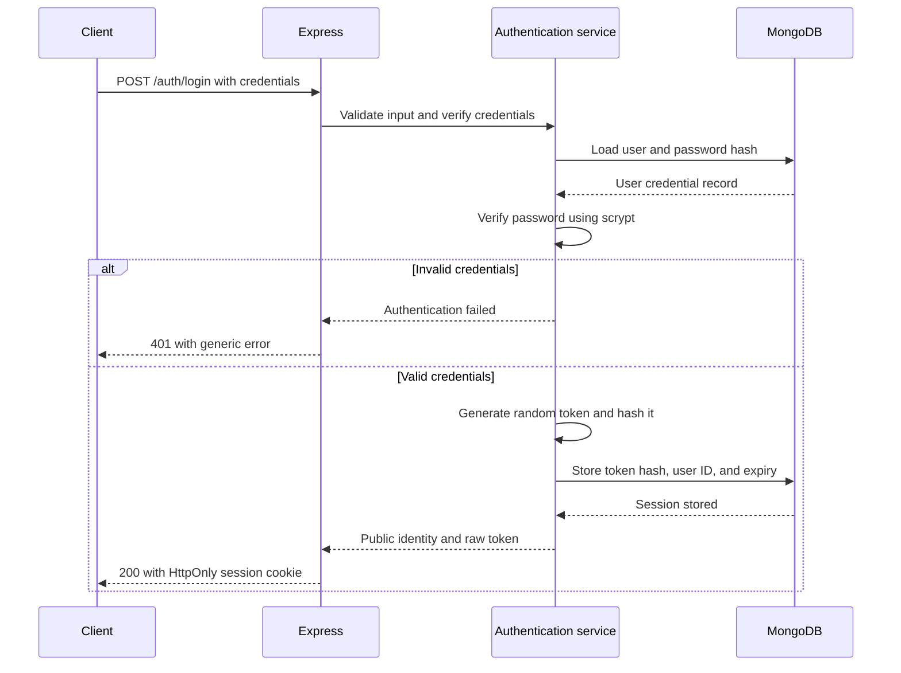
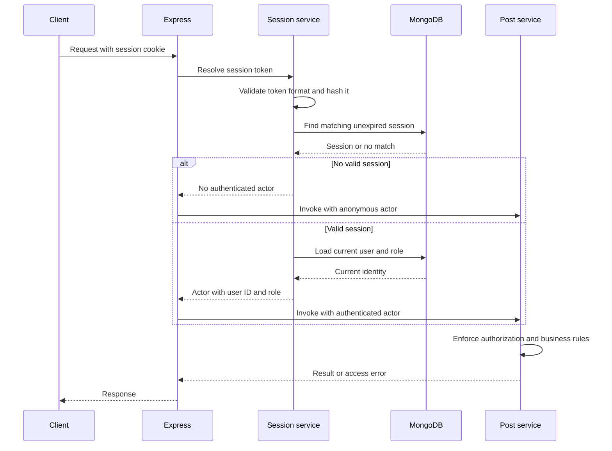
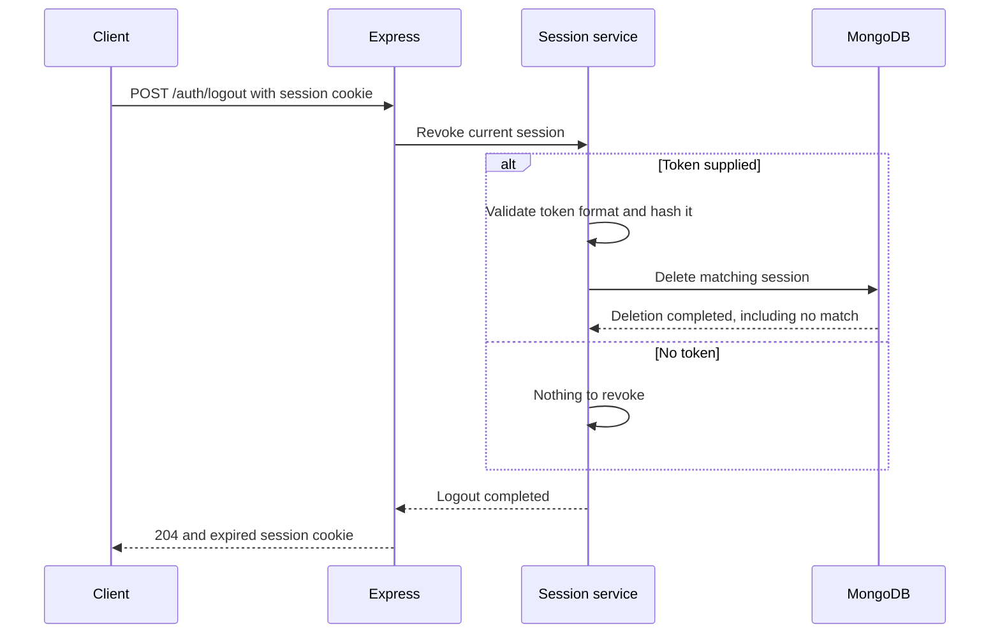

# Session authentication design

Authentication is planned but not yet implemented.

## Operations

- POST /auth/login accepts a username and password.
- GET /auth/me returns public identity for a valid session.
- POST /auth/logout revokes the current session and clears its cookie.
- GraphQL uses the same session service to populate context.actor.

## Credentials and provisioning

- Passwords use salted asynchronous scrypt with explicit parameters.
- Stored credentials include the salt, hash, and algorithm parameters.
- Passwords and raw session tokens must not appear in logs or traces.
- Initial users are provisioned through a Docker-run administrative command.
- Ordinary accounts receive the user role.
- Admin provisioning is an explicit administrative action.
- Public inputs cannot assign roles.
- Existing seed users remain unable to log in until provisioned.

## Sessions

- Generate a new 32-byte cryptographically random token on login.
- Store its SHA-256 hash, user ID, creation time, and expiry in MongoDB.
- Send the raw token only through the session cookie.
- Sessions expire eight hours after creation without sliding renewal.
- Multiple sessions per user are allowed.
- Logout revokes only the current session.
- Validate expiry during lookup; database cleanup is not the expiry check.
- Load the current user's role when constructing the actor.

## Cookies and browser requests

- Cookie name: session.
- HttpOnly: true.
- SameSite: Lax.
- Path: /.
- Omit Domain to keep the cookie host-only.
- Local HTTP development uses Secure: false.
- Production requires HTTPS and Secure: true.
- Cookie lifetime matches session expiry.
- Clearing the cookie uses the same name, path, and domain scope.
- State-changing browser requests require CSRF protection.
- SameSite alone is not the complete CSRF policy.
- Credentialed browser access is restricted to the configured application origin.

## Failure behavior

- Invalid login credentials return the same generic 401 response.
- No cookie, an invalid token, an expired session, or a revoked session
  produces no authenticated actor.
- GET /auth/me returns 401 when no authenticated actor exists.
- Authentication-storage failure returns a generic service-unavailable
  error; it must not silently downgrade a session-bearing request to anonymous.
- Missing or already revoked sessions can be logged out idempotently.
- A database failure must not be reported as successful session revocation.
- Authorization remains the responsibility of post services.

## Authentication flow

### Login

The raw token is sent in the cookie, not the response body.
No successful login is reported unless session storage succeeds.

### Authenticated request

GraphQL receives the actor through request context.
Protected operations reject anonymous actors.

If session storage is unavailable, return a service-unavailable error
instead of treating a session-bearing request as anonymous.

### Logout

Logout is idempotent when the session is missing or already revoked.
A storage failure returns a service-unavailable error rather than
reporting successful revocation.

## Verification scenarios

| Scenario | Expected |
|---|---|
| Correct username and password | 200, session stored, session cookie set |
| Incorrect password | Generic 401; no session created |
| Unknown username | Same generic 401; no session created |
| Malformed login input | 400; no session created |
| Login when session storage fails | 503; no authenticated session issued |
| Current-user request with valid session | 200 with public identity |
| Current-user request without cookie | 401 |
| Malformed, unknown, expired, or revoked token | 401 |
| Session references a deleted user | 401 |
| User role changes after login | Next request uses the current role |
| Authentication storage unavailable | 503; no anonymous fallback |
| Logout with valid session | 204; session revoked and cookie cleared |
| Logout with no session or an already revoked session | 204; cookie cleared |
| Logout when revocation storage fails | 503; revocation not reported as successful |
| Two sessions exist and one logs out | Other session remains valid |
| Disallowed browser origin on a state-changing request | Rejected before state changes |
| Inspect logs, traces, and public responses | No password, password hash, or raw session token exposed |

Cookie attributes must be verified separately in local development
and production configuration.

A valid session establishes identity but does not bypass post
authorization or publication business rules.
