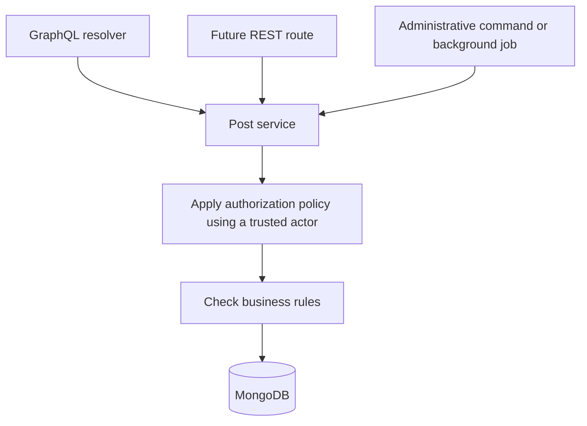
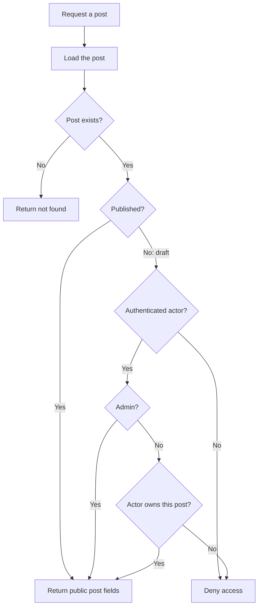
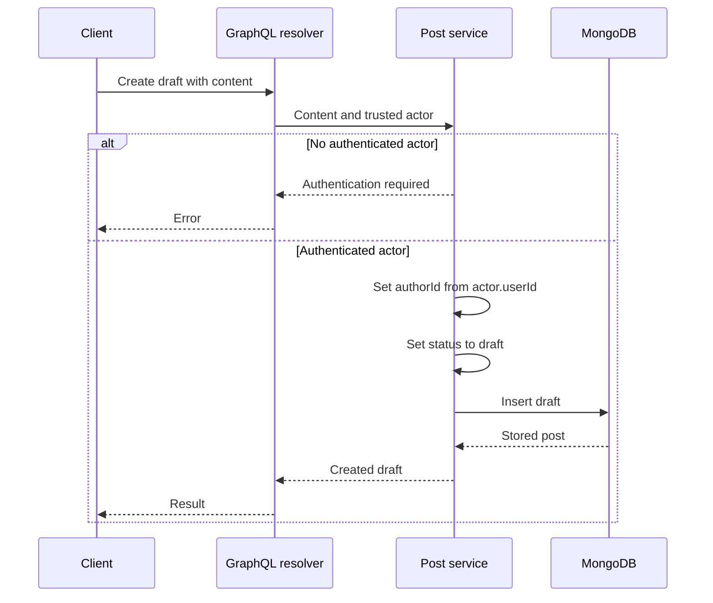
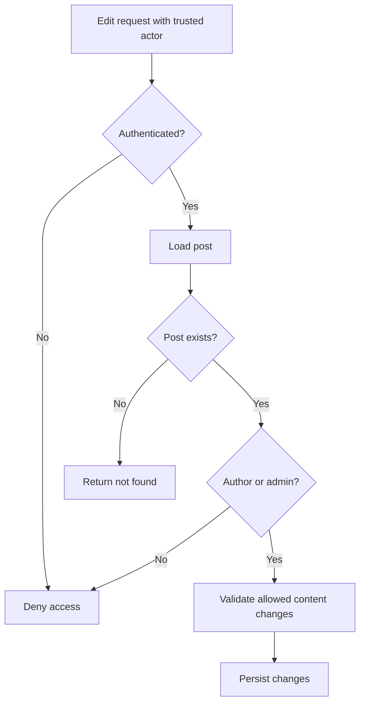
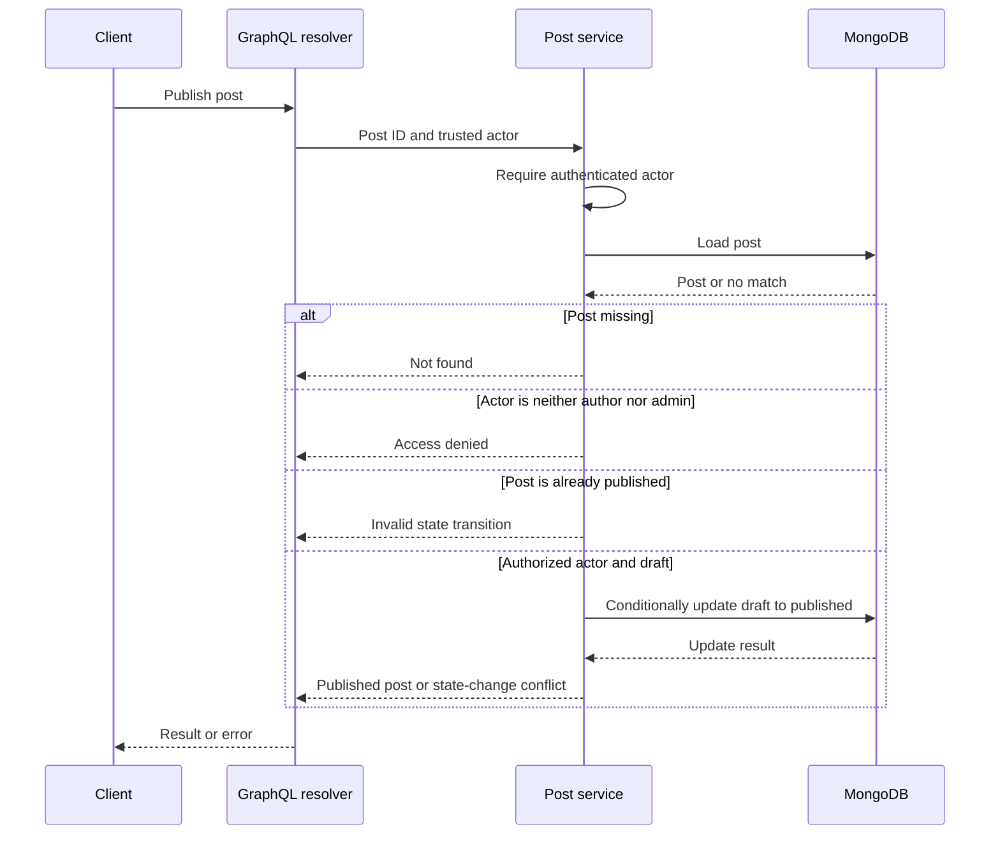
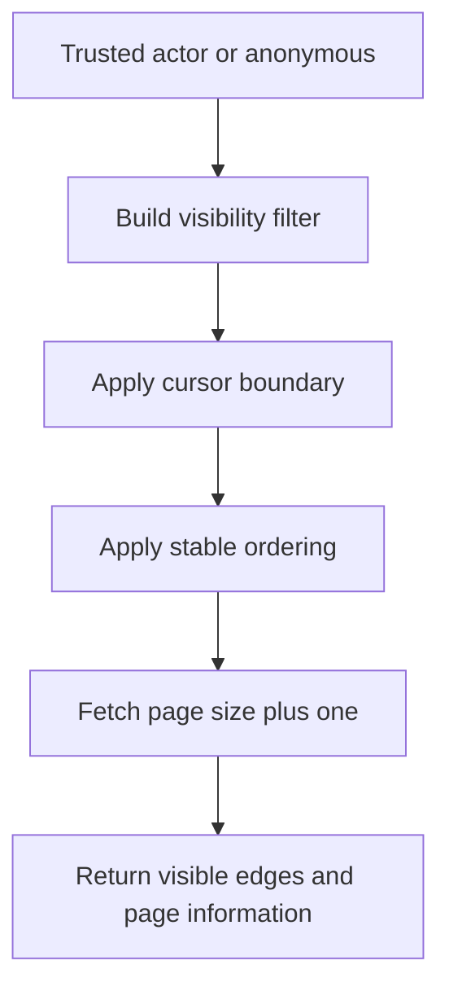

# Authorization design

This document defines the intended policy. Authentication and
authorization enforcement are not yet implemented.

## Identity and post status

- An actor is an authenticated user with a user ID and a role:
  user or admin.
- Anonymous requests have no actor.
- "Post author" means the authenticated user whose ID matches
  the post's authorId. It is a relationship, not a global role.
- Posts have a status of draft or published.
- Existing seed posts have been marked published.

## Permissions

| Action | Anonymous | Signed-in non-author | Post author | Admin |
|---|---|---|---|---|
| Read published posts | Allowed | Allowed | Allowed | Allowed |
| Read a draft | Denied | Denied | Allowed | Allowed |
| Create a draft | Denied | Allowed | Allowed | Allowed |
| Edit a post | Denied | Denied | Allowed | Allowed |
| Publish a draft | Denied | Denied | Allowed | Allowed |

Creating a draft assigns the authenticated actor as its author.
Clients cannot choose another author through this operation.

Publishing requires the post to currently be a draft, including
when the actor is an admin.

## Responsibility boundaries

| Responsibility | Question | Example |
|---|---|---|
| Authentication | Who is making this request? | Resolve a session to Grace |
| Object authorization | May this actor access this post? | Grace owns this draft |
| Business rules | Is the requested action valid now? | Only a draft can be published |

A valid session establishes identity. It does not grant access
to every post.

### Enforcement location

Post services enforce object authorization and business rules.
GraphQL resolvers obtain a trusted actor from request context and
pass it to those services.

Future REST routes, administrative commands, and background jobs
must use the same services with an explicitly established identity.
Calling from an internal entry point does not automatically grant access.

GraphQL arguments cannot establish or override the actor's identity.

## Reading a single post

Published posts are publicly readable.
Drafts are readable only by their author or an admin.

The client-visible response for an inaccessible private post will
be chosen during implementation to avoid exposing its existence.

## Creating a draft

Both ordinary users and admins create drafts under their own identity.
Assigning a draft to another author is outside the initial scope.

## Editing a post

Authors and admins may edit draft or published posts.

Editing content must not implicitly transfer ownership, change roles,
or publish a draft. Publication is a separate operation.

## Publishing a draft

Authorization and state validation are separate checks.
An admin can pass authorization and still fail the business rule.

The write must enforce the expected state so concurrent requests
cannot both claim the same successful publication transition.
Implementation will also address authorization changes between
reading and writing.

## Listing posts with pagination

Visibility rules:

| Actor | Visible posts |
|---|---|
| Anonymous | Published posts |
| Ordinary user | Published posts and their own drafts |
| Admin | All posts |

Filter inaccessible records before applying the page limit and
calculating hasNextPage.

Filtering after pagination can produce short pages and page information
influenced by records the actor cannot access.

## Field exposure

Document access does not mean every stored field is public.

Resolvers must return explicitly selected API fields.
Password hashes, session data, and other internal credentials
must never be exposed through user or post results.

## Authorization test scenarios

| Scenario | Expected |
|---|---|
| Anonymous visitor reads a published post | Allowed |
| Anonymous visitor reads a draft | Denied |
| Ada reads Grace's draft | Denied |
| Grace reads her own draft | Allowed |
| Admin reads Grace's draft | Allowed |
| Anonymous visitor creates a draft | Denied |
| Ada creates a draft | Allowed; author is Ada |
| Ada edits Grace's post | Denied |
| Grace edits her own post | Allowed |
| Admin edits Grace's post | Allowed |
| Grace publishes her own draft | Allowed |
| Ada publishes Grace's draft | Denied |
| Admin publishes Grace's draft | Allowed |
| Grace publishes an already published post | Rejected by business rule |
| Admin publishes an already published post | Rejected by business rule |
| Anonymous visitor lists posts | Published posts only |
| Ada lists posts | Published posts and Ada's drafts |
| Admin lists posts | All posts |
| Service is called through another entry point | Same authorization policy applies |

These scenarios define expected behavior for subsequent
implementation tickets.
